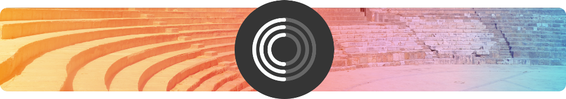

# Demo Swift Carthage

This demonstration shows:

 * The [Swift 3](http://swift.org) programming language with
   [Apple](http://apple.com)
   [iOS 10](http://www.apple.com/ios/) and
   [Xcode 8](https://developer.apple.com/xcode/)

 * The [Carthage](https://github.com/Carthage/Carthage) dependency manager.

 * The [Prelude](https://github.com/robrix/Prelude) Swift micro-framework of simple functional programming tools.

Your can get the project by cloning this repo.

Or if you prefer to learn how to create the project yourself, then this README explains how to do it.

## How to create the project

1. Launch Xcode. 

1. `File` → `New`. 

  * Choose a template for your new project. We use "Single View Application".

  * Click `Next`.

1. Choose your product settings.

  * For "Product Name", type anything you want. We use "Demo Swift Carthage". 

  * Set the rest of the settings as you like.

  * Click `Next`.

1. If Xcode prompts you to choose a development team, then do it.

1. Need help? See our repo [demo_swift_hello_world](https://github.com/joelparkerhenderson/demo_swift_hello_world).

## Add Carthage

1. To see if you have Carthage installed, and if it is current, run this command:

    $ carthage version
    0.17.2

1. If you need to install Carthage, follow these [Carthage instructions](https://github.com/Carthage/Carthage)

1. Go to the Xcode project "Build Phases" settings area.

  * Click the "+" icon and choose to add a new "Run Script".

  * Set the "Shell" field to `/bin/sh`. 

  * Set the big blank command field to `/usr/local/bin/carthage copy-frameworks`

  * In the area "Add input files here", click "+".

  * Set the "Input Files" to `$(SRCROOT)/Carthage/Build/iOS/Prelude.framework`

## Create a Cartfile
 
1. Create a file named `Cartfile` at the top level of the project. 
   
1. In the `Cartfile`, list any framework you want, such the Prelude Swift micro-framework of simple functional programming tools.

    github "robrix/Prelude"

1. Run an update, and you see the system is getting the framework.

    $ carthage update
    *** Fetching Prelude
    *** Downloading Prelude.framework binary at "2.0"
    *** xcodebuild output can be found in /var/folders/…

1. See the results if you like.

  * You now have a new directory `Carthage` that contains the Build directory and the framework files.

  * You now have a new file `Cartfile.resolved` that lists the framework and its exact version number.

    $ ls -1
    Cartfile
    Cartfile.resolved
    Carthage
    Demo Swift Carthage
    Demo Swift Carthage.xcodeproj
    Demo Swift CarthageTests
    Demo Swift CarthageUITests

    $ ls Carthage
    Build

    $ cat Cartfile.resolved
    github "robrix/Prelude" "2.0.0"

## Verify

1. Run the app as usual.

  * This will verify that Carthage can connect the files.

  * The app will launch normally. 

  * Success!

  
## Tracking

* Package: demo_swift_carthage
* Version: 2.0.0
* Created: 2016-04-09
* Updated: 2016-09-18
* License: BSD, MIT, GPL
* Contact: Joel Parker Henderson (joel@joelparkerhenderson.com)
